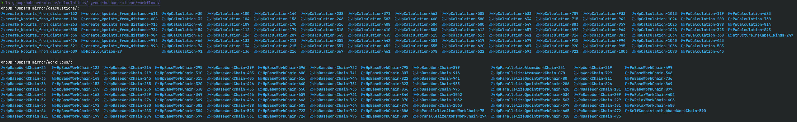

# Data dumping in AiiDA

The simplest way to dump your data out of AiiDA's internal database and file repository is through the CLI using the
`verdi [process|group|profile] dump` endpoints.
By default, files will be dumped to disk in the current working directory (CWD) and in `incremental` dumping mode.
This means that, as you run your simulations through AiiDA and you keep executing the command, relevant files of
those new simulations will gradually be written to the directory.
Instead, if the command is run with the `-o/--overwrite` option, the output directory will be cleaned, and re-created from
scratch with the data available in the specified entity, be that an individual process, a group, or the whole AiiDA
profile.

The command was intended to further bridge the gap between research conducted with AiiDA and scientists not familiar with AiiDA.
Some possible use cases that were considered while developing the feature are:

1. Sharing the resulting `dump` directory of a data collection with collaborators unfamiliar with AiiDA such that it can be explored by others, or
1. Periodically running the command (e.g., via `cron`) to reflect changes while working on a project, such that they can
   be analyzed in the "classical" way (using shell tools, rather than AiiDA's programmatic approach).

## CLI options

All 3 commands provide various customization options to fine-tune their behavior. They are outlined below:

<details>
<summary><code>verdi process dump -h</code></summary>

```
Options:
  -p, --path PATH                 Base path for dump operations that write to disk.
  -o, --overwrite                 Overwrite file/directory when writing to
                                  disk.
  --include-inputs / --exclude-inputs
                                  Include linked input nodes of
                                  `CalculationNode`(s).  [default: include-
                                  inputs]
  --include-outputs / --exclude-outputs
                                  Include linked output nodes of
                                  `CalculationNode`(s).  [default: exclude-
                                  outputs]
  --include-attributes / --exclude-attributes
                                  Include attributes in the
                                  `.aiida_node_metadata.yaml` written for
                                  every `ProcessNode`.  [default: include-
                                  attributes]
  --include-extras / --exclude-extras
                                  Include extras in the
                                  `.aiida_node_metadata.yaml` written for
                                  every `ProcessNode`.  [default: include-
                                  extras]
  -f, --flat                      Dump files in a flat directory for every
                                  step of a workflow.
  --dump-unsealed / --no-dump-unsealed
                                  Also allow the dumping of unsealed process
                                  nodes.  [default: no-dump-unsealed]
  -v, --verbosity [notset|debug|info|report|warning|error|critical]
                                  Set the verbosity of the output.
  -h, --help                      Show this message and exit.
```

</details>

<details>
<summary><code>verdi group dump -h</code></summary>

```
Options:
  -p, --path PATH                 Base path for dump operations that write
                                  to disk.
  -o, --overwrite                 Overwrite file/directory when writing to
                                  disk.
  --filter-by-last-dump-time / --no-filter-by-last-dump-time
                                  Only select nodes with an `mtime` after the
                                  last dump time.  [default: filter-by-last-
                                  dump-time]
  --dump-processes / --no-dump-processes
                                  Dump process data.  [default: dump-
                                  processes]
  --dump-data / --no-dump-data
                                  Dump data nodes.  [default: no-dump-data]
  --delete-missing / --no-delete-missing
                                  If a previously dumped node is deleted
                                  from AiiDA's DB, also delete the
                                  corresponding dump directory.  [default:
                                  no-delete-missing]
  --only-top-level-calcs / --no-only-top-level-calcs
                                  Dump calculations in their own dedicated
                                  directories, not just as part of the
                                  dumped workflow.  [default: only-top-
                                  level-calcs]
  --only-top-level-workflows / --no-only-top-level-workflows
                                  If a top-level workflow calls sub-workflows,
                                  create a designated directory only for the
                                  top-level workflow.  [default: only-top-
  --symlink-calcs / --no-symlink-calcs
                                  Symlink workflow sub-calculations to their own dedicated directories.  [default: no-symlink-
                                  calcs]
  --include-inputs / --exclude-inputs
                                  Include linked input nodes of
                                  `CalculationNode`(s).  [default: include-
                                  inputs]
  --include-outputs / --exclude-outputs
                                  Include linked output nodes of
                                  `CalculationNode`(s).  [default: exclude-
                                  outputs]
  --include-attributes / --exclude-attributes
                                  Include attributes in the
                                  `.aiida_node_metadata.yaml` written for
                                  every `ProcessNode`.  [default: include-
                                  attributes]
  --include-extras / --exclude-extras
                                  Include extras in the
                                  `.aiida_node_metadata.yaml` written for
                                  every `ProcessNode`.  [default: include-
                                  extras]
  -f, --flat                      Dump files in a flat directory for every
                                  step of a workflow.
  --dump-unsealed / --no-dump-unsealed
                                  Also allow the dumping of unsealed process
                                  nodes.  [default: no-dump-unsealed]
  -v, --verbosity [notset|debug|info|report|warning|error|critical]
                                  Set the verbosity of the output.
  -h, --help                      Show this message and exit.
```

</details>

As you can see, the `verdi group dump` command exposes various options to specify the behavior of the dumping of the selected group which influence the resulting directory structure.
These options are `filter-by-last-dump-time`, `dump-processes`, `dump-data` (currently not implemented yet), `delete-missing`, `only-top-level-calcs`,
`only-top-level-workflows`, and `symlink-calcs`,
In addition, the same options as for the `verdi process dump` command are available. This is
because groups likely contain processes, and so the behavior of dumping individual processes should be
controllable when dumping the content of a group.

In accordance, the `verdi profile dump` command exposes all options of `verdi process dump` and `verdi group dump`, as well as additional options that can be seen below:

<details>
<summary><code>verdi profile dump -h</code></summary>

Options:
-p, --path PATH Base path for dump operations that write
to disk.
-o, --overwrite Overwrite file/directory when writing to
disk.
-G, --groups GROUP... One or multiple groups identified by their
ID, UUID or label.
--filter-by-last-dump-time / --no-filter-by-last-dump-time
Only select nodes whose `mtime` is after the
last dump time. [default: filter-by-last-
dump-time]
--dump-processes / --no-dump-processes
Dump process data. [default: dump-
processes]
--dump-data / --no-dump-data
Dump data nodes. [default: no-dump-
data]
--only-top-level-calcs / --no-only-top-level-calcs
Dump calculations in their own dedicated
directories, not just as part of the
dumped workflow. [default: only-top-
level-calcs]
--only-top-level-workflows / --no-only-top-level-workflows
If a top-level workflow calls sub-workflows,
create a designated directory only for the
top-level workflow. [default: only-top-
level-workflows]
--delete-missing / --no-delete-missing
If a previously dumped node is deleted
from AiiDA's DB, also delete the
corresponding dump directory. [default:
no-delete-missing]
--symlink-calcs / --no-symlink-calcs
Symlink workflow sub-calculations to their
own dedicated directories. [default: no-
symlink-calcs]
--symlink-between-groups / --no-symlink-between-groups
Symlink data if the same node is contained
in multiple groups. [default: no-symlink-
between-groups]
--organize-by-groups / --no-organize-by-groups
If the collection of nodes to be dumped is
organized in groups, reproduce its
hierarchy. [default: organize-by-groups]
--also-ungrouped / --no-also-ungrouped
Dump only data of nodes which are already
organized in groups. [default: no-only-
groups]
--update-groups / --no-update-groups
Update directories if nodes have been added
to other groups, or organized differently in
terms of groups. [default: no-update-
groups]
--include-inputs / --exclude-inputs
Include linked input nodes of
`CalculationNode`(s). [default: include-
inputs]
--include-outputs / --exclude-outputs
Include linked output nodes of
`CalculationNode`(s). [default: exclude-
outputs]
--include-attributes / --exclude-attributes
Include attributes in the
`.aiida_node_metadata.yaml` written for
every `ProcessNode`. [default: include-
attributes]
--include-extras / --exclude-extras
Include extras in the
`.aiida_node_metadata.yaml` written for
every `ProcessNode`. [default: include-
extras]
-f, --flat Dump files in a flat directory for every
step of a workflow.
--dump-unsealed / --no-dump-unsealed
Also allow the dumping of unsealed process
nodes. [default: no-dump-unsealed]
-v, --verbosity [notset|debug|info|report|warning|error|critical]
Set the verbosity of the output.
-h, --help Show this message and exit.

</details>

The additional options are `--groups`, `--symlink-between-groups`, `--organize-by-groups`, `--also-ungrouped`, and
`--update-groups`, and, therefore control mainly the behavior of groups in the profile during dumping.

The final list of options is rather lengthy, but, worry not, sensible defaults have been chosen and should be fine in most cases.
The default dumping command will result in a self-contained, logical directory structure, ready for sharing.

## Some examples

### Dumping groups

Documentation for the `verdi process dump` feature is already available
[here](https://aiida.readthedocs.io/projects/aiida-core/en/latest/howto/data.html#dumping-data-to-disk), thus we will
first focus on the other two commands `verdi group dump`. Assume you have an AiiDA profile with the following groups:

```
❯ verdi group list -C
Report: To show groups of all types, use the `-a/--all` option.
  PK  Label               Type string    User               Node count
----  ------------------  -------------  ---------------  ------------
   1  add-group           core           aiida@localhost             1
   2  multiply-add-group  core           aiida@localhost             1
```

Where `add-group` contains one `ArithmeticAddCalculation` and `multiply-add-group` contains one `MultiplyAddWorkchain`.
Running `verdi group dump 1` gives:

```
❯ verdi group dump 1
Report: Dumping data of group `add-group` at path `add-group-dump`.
Report: Incremental dumping selected. Will update directory.
Report: Collecting nodes from the database for group `add-group`.
Report: For the first dump, this can take a while.
Report: Dumping 1 calculations...
Report: No (new) workflows to dump in group `add-group`.
Success: Raw files for group `add-group` <1> dumped into folder `add-group-dump`.
```

with the following output directory structure:

```
❯ tree add-group-dump/
add-group-dump
└── calculations
   └── ArithmeticAddCalculation-4
      ├── inputs
      │  ├── _aiidasubmit.sh
      │  └── aiida.in
      ├── node_inputs
      └── outputs
         ├── _scheduler-stderr.txt
         ├── _scheduler-stdout.txt
         └── aiida.out
```

Similarly, for the `multiply-add-group`:

```
❯ verdi group dump 2
Report: Dumping data of group `multiply-add-group` at path `multiply-add-group-dump`.
Report: Incremental dumping selected. Will update directory.
Report: Collecting nodes from the database. For the first dump, this can take a while.
Report: No (new) calculations to dump in group `multiply-add-group`.
Report: Dumping 1 workflows...
Success: Raw files for group `multiply-add-group` <2> dumped into folder `multiply-add-group-dump`.
```

with the directory:

```
❯ tree multiply-add-group-dump/
multiply-add-group-dump
└── workflows
   └── MultiplyAddWorkChain-11
      ├── 01-multiply-12
      │  ├── inputs
      │  │  └── source_file
      │  └── node_inputs
      └── 02-ArithmeticAddCalculation-14
         ├── inputs
         │  ├── _aiidasubmit.sh
         │  └── aiida.in
         ├── node_inputs
         └── outputs
            ├── _scheduler-stderr.txt
            ├── _scheduler-stdout.txt
            └── aiida.out
```

The output directory is the group `label`, appended by `dump`, created in the CWD.
This can, of course, be changed by passing the `--path` argument.
In this directory, depending on the type of process, directories for each `ProcessNode` are placed in `calculations` or
`workflows` subdirectories.

### Dumping the entire profile

Dumping the data of the entire profile proceeds as follows:

```
❯ verdi profile dump
Report: Dumping data of profile `readme` at path `profile-readme-dump`.
Report: Incremental dumping selected. Will update directory.
Report: Dumping processes in group `add-group` for profile `readme`...
Report: Collecting nodes from the database for group `add-group`.
Report: For the first dump, this can take a while.
Report: Dumping 1 calculations...
Report: No (new) workflows to dump in group `add-group`.
Report: Dumping processes in group `multiply-add-group` for profile `readme`...
Report: Collecting nodes from the database for group `multiply-add-group`.
Report: For the first dump, this can take a while.
Report: No (new) calculations to dump in group `multiply-add-group`.
Report: Dumping 1 workflows...
Success: Raw files for profile `readme` dumped into folder `profile-readme-dump`.
```

and gives the directory tree:

```
❯ tree profile-readme-dump/
profile-readme-dump
├── groups
   ├── add-group
   │  └── calculations
   │     └── ArithmeticAddCalculation-4
   │        ├── inputs
   │        │  ├── _aiidasubmit.sh
   │        │  └── aiida.in
   │        ├── node_inputs
   │        └── outputs
   │           ├── _scheduler-stderr.txt
   │           ├── _scheduler-stdout.txt
   │           └── aiida.out
   └── multiply-add-group
      └── workflows
         └── MultiplyAddWorkChain-11
            ├── 01-multiply-12
            │  ├── inputs
            │  │  └── source_file
            │  └── node_inputs
            └── 02-ArithmeticAddCalculation-14
               ├── inputs
               │  ├── _aiidasubmit.sh
               │  └── aiida.in
               ├── node_inputs
               └── outputs
                  ├── _scheduler-stderr.txt
                  ├── _scheduler-stdout.txt
                  └── aiida.out
```

Thus, the `verdi profile dump` command respects your internal AiiDA data organization in groups.

### JSON dump log file

If we have a closer look and show also the hidden files:

```
❯ tree -a add-group-dump/
add-group-dump
├── .aiida_dump_safeguard
├── .aiida_dump_log.json
└── calculations
   └── ArithmeticAddCalculation-4
      ├── .aiida_node_metadata.yaml
      ├── .aiida_dump_safeguard
      ├── inputs
      │  ├── .aiida
      │  │  ├── calcinfo.json
      │  │  └── job_tmpl.json
      │  ├── _aiidasubmit.sh
      │  └── aiida.in
      ├── node_inputs
      └── outputs
         ├── _scheduler-stderr.txt
         ├── _scheduler-stdout.txt
         └── aiida.out
```

we can see that the hidden `.aiida` directory from the working directory of the simulation is also available under the
`inputs` subdirectory of the calculation.

In addition, the top-level output directory `add-group-dump` contains the `.aiida_dump_log.json` file that keeps a history
of the nodes that are dumped to disk, and is therefore essential for incremental dumping.
For the dump of the `add-group`, it holds the following content:

```json
{
    "calculations": {
        "57a1e7ce-c845-47e8-a940-786a91540a09": {
            "path": "/home/geiger_j/aiida_projects/verdi-profile-dump/dev-dumps/add-group-dump/calculations/ArithmeticAddCalculation-4"
        }
    },
    "workflows": {},
    "groups": {
        "aa13ae86-d6c5-4d2c-94e4-3d42d9619012": {
            "path": "/home/geiger_j/aiida_projects/verdi-profile-dump/dev-dumps/add-group-dump"
        }
    },
    "data": {},
    "last_dump_time": "2025-04-09T21:45:03.433577+02:00"
}
```

Thus, the file keeps track of the dump `path`s, for dumped `calculations`, `workflows`, `groups`, and `data`, as
well as the `last_dump_time`.
More info about the JSON log file will be outlined further below.

### Safety when overwriting

You can also see that an `.aiida_dump_safeguard` file is contained in every directory created by the dump feature for each ORM entitity.
This file serves as a (surprise...) safeguard file, as, in `overwrite` mode, the `dump` command option performs a
dangerous recursive deletion operation of a previous output directory.
If, for whatever reason, the directory that is supposed to be cleaned by the dump feature in `overwrite` mode is _not_
the correct one, the command will abort if it does not find the `.aiida_dump_safeguard` file, thus ensuring the
command doesn't accidentally delete crypto wallet.
So don't mess with that file!!

### Efficient incremental dumping

Now that we have already dumped each group and we didn't add any new nodes, if we run the dump command again:

```
❯ verdi group dump 1
Report: Dumping data of group `add-group` at path `add-group-dump`.
Report: Incremental dumping selected. Will update directory.
Report: Collecting nodes from the database.
Report: No (new) calculations to dump in group `add-group`.
Report: No (new) workflows to dump in group `add-group`.
Success: Raw files for group `add-group` <1> dumped into folder `add-group-dump`.
```

it should finish almost instantaneously, as there are no new simulations to dump.

The evaluation of new nodes that should be dumped is based on the entries in the `.aiida_dump_log.json` file and the
last time the `dump` command was run. This information is used to construct a `QueryBuilder` instance that
extracts the relevant nodes from the database.
As this step is the very first one done in the code, and the query is executed using SQL, incremental dumping for a
small number of new simulations should be quick, even for a large database (TODO: add benchmark tests).
The first time a large database is dumped, however, depending on the number of nodes, might take a considerable amount of time, due to the many individual I/O operations to write the relevant files for each process.

#### Customizing `verdi [group|profile] mirrror`

As mentioned above, we have the following CLI options when dumping AiiDA groups:

```
  --filter-by-last-dump-time / --no-filter-by-last-dump-time
                                  Only select nodes whose `mtime` is after the
                                  last dump time.  [default: filter-by-last-
                                  dump-time]
  --dump-processes / --no-dump-processes
                                  Dump process data.  [default: dump-
                                  processes]
  --dump-data / --no-dump-data
                                  Dump data nodes.  [default: no-dump-
                                  data]
  --delete-missing / --no-delete-missing
                                  If a previously dumped node is deleted
                                  from AiiDA's DB, also delete the
                                  corresponding dump directory.  [default:
                                  no-delete-missing]
  --only-top-level-calcs / --no-only-top-level-calcs
                                  Dump calculations in their own dedicated
                                  directories, not just as part of the
                                  dumped workflow.  [default: only-top-
                                  level-calcs]
  --only-top-level-workflows / --no-only-top-level-workflows
                                  If a top-level workflow calls sub-workflows,
                                  create a designated directory only for the
                                  top-level workflow.  [default: only-top-
                                  level-workflows]
  --symlink-calcs / --no-symlink-calcs
                                  Symlink workflow sub-calculations to their
                                  own dedicated directories.  [default: no-
                                  symlink-calcs]
```

Let's consider how they change the behavior one by one.

##### `only-top-level-calcs`/`only-top-level-workflows`

One thing you might have already noticed is that even though the `MultiplyAddWorkchain` calls both, a `multiply`
`calcfunction`, as well as an `ArithmeticAdd` `CalcJob`, there is no `calculations` subdirectory in the `add-group-dump`
output directory, and, instead, only one `MultiplyAddWorkChain` subdirectory under the `workflows` directory.
This is because, by default, only top-level workflows and calculations (meaning they don't have a `CALLER`) are put into their own, separate directories.
During dumping, these top-level processes are then traversed recursively, and the files written. Thus, no extra
top-level output directory for the `ArithmeticAddCalculation` called by the `MultiplyAddWorkChain` is created, as it is instead
dumped into a subdirectory of the `MultiplyAddWorkChain` output folder.
If you want to obtain _all_ calculations and workflows of your group/profile in the dedicated `calculations` and
`workflows` directories, you can use the `--no-only-top-level-calcs` and/or `--no-only-top-level-workflows` flags.
In that case, the report from running the command indicates that, in addition to the 1 workflow we've seen before, also
2 calculations are being dumped for the `multiply-add-group`:

```
❯ verdi group dump multiply-add-group -o --no-only-top-level-calcs
Report: Dumping data of group `multiply-add-group` at path `multiply-add-group-dump`.
Report: Overwriting selected. Will clean directory first.
Report: Collecting nodes from the database.
Report: For the first dump, this can take a while.
Report: Dumping 2 calculations...
Report: Dumping 1 workflows...
Success: Raw files for group `multiply-add-group` <2> dumped into folder `multiply-add-group-dump`.
```

The resulting directory structure looks like this:

```
❯ tree -D multiply-add-group-dump/
multiply-add-group-dump
├── calculations
│  ├── ArithmeticAddCalculation-14
│  │  ├── inputs
│  │  ├── node_inputs
│  │  └── outputs
│  └── multiply-12
│     ├── inputs
│     └── node_inputs
└── workflows
   └── MultiplyAddWorkChain-11
      ├── 01-multiply-12
      │  ├── inputs
      │  └── node_inputs
      └── 02-ArithmeticAddCalculation-14
         ├── inputs
         ├── node_inputs
         └── outputs
```

This means you have _all_ calculations and workflows of the group directly accessible in the `calculations` and
`workflows` directories, rather than inside the nested sub-directories of the top-level workflows.

For instance for a complex `SelfConsistentHubbardWorkChain`:

<details>
<summary><code>verdi process status 590</code></summary>
```
SelfConsistentHubbardWorkChain<590> Finished [0] [2:run_results]
    ├── PwBaseWorkChain<229> Finished [0] [3:results]
    │   ├── create_kpoints_from_distance<356> Finished [0]
    │   └── PwCalculation<643> Finished [0]
    ├── PwBaseWorkChain<301> Finished [0] [3:results]
    │   ├── create_kpoints_from_distance<734> Finished [0]
    │   └── PwCalculation<278> Finished [0]
    ├── HpWorkChain<826> Finished [0] [3:results]
    │   ├── create_kpoints_from_distance<611> Finished [0]
    │   └── HpParallelizeAtomsWorkChain<878> Finished [0] [6:results]
    │       ├── HpBaseWorkChain<397> Finished [0] [3:results]
    │       │   └── HpCalculation<647> Finished [0]
    │       ├── HpParallelizeQpointsWorkChain<428> Finished [0] [5:results]
    │       │   ├── HpBaseWorkChain<762> Finished [0] [3:results]
    │       │   │   └── HpCalculation<994> Finished [0]
...
```

</details>

<!-- region -->

The dumped output directory looks as follows:

<details>
<summary>Dump of a `SelfconsistentHubbardWorkchain`</summary>

```
group-hubbard-dump/workflows/SelfConsistentHubbardWorkChain-590
├── 01-iteration_01_scf_smearing-PwBaseWorkChain-229
│  ├── 01-create_kpoints_from_distance-356
│  │  ├── inputs
│  │  └── node_inputs
│  │     └── structure
│  └── 02-iteration_01-PwCalculation-643
│     ├── inputs
│     ├── node_inputs
│     │  ├── pseudos
│     │  │  ├── Mn
│     │  │  ├── O0
│     │  │  └── O1
│     │  └── structure
│     └── outputs
├── 02-iteration_01_scf_fixed_magnetic-PwBaseWorkChain-301
│  ├── 01-create_kpoints_from_distance-734
│  │  ├── inputs
│  │  └── node_inputs
│  │     └── structure
│  └── 02-iteration_01-PwCalculation-278
│     ├── inputs
│     ├── node_inputs
│     │  ├── pseudos
│     │  │  ├── Mn
│     │  │  ├── O0
│     │  │  └── O1
│     │  └── structure
│     └── outputs
├── 03-iteration_01_hp-HpWorkChain-826
│  ├── 01-create_qpoints_from_distance-create_kpoints_from_distance-611
│  │  ├── inputs
│  │  └── node_inputs
│  │     └── structure
│  └── 02-iteration_01_hp-HpParallelizeAtomsWorkChain-878
│     ├── 01-initialization-HpBaseWorkChain-397
│     │  └── 01-iteration_01-HpCalculation-647
│     │     ├── inputs
│     │     ├── node_inputs
│     │     │  └── hubbard_structure
│     │     └── outputs

... (this continues for another >1k lines)

```

</details>

<!-- endregion -->

Running the command with the flags `--no-only-top-level-workflows` and
`--no-only-top-level-calcs` makes access to the relevant sub-calculations and workflows easier:

<details><summary>Top-level `ls` on processes of the SelfConsistentHubbardWorkChain</summary>

</details>

##### `--symlink-calcs`

Using the flag `--no-only-top-level-calcs`, calculations are being dumped in their own, dedicated directories, under
`calculations`. This is in addition to subdirectories that were created for these `CalculationNode`s in the dump
directories of the `WorkflowNode`s from which they were called (if so).
This can lead to data duplication, which is why the `--symlink-calcs` flag can be used to symlink the dump directories of
the calculations to the subdirectories of the parent workflows:

```
❯ verdi group dump multiply-add-group -o --no-only-top-level-calcs --symlink-calcs
Report: Dumping data of group `multiply-add-group` at path `multiply-add-group-dump`.
Report: Overwriting selected. Will clean directory first.
Report: Collecting nodes from the database.
Report: For the first dump, this can take a while.
Report: Dumping 2 calculations...
Report: Dumping 1 workflows...
Success: Raw files for group `multiply-add-group` <2> dumped into folder `multiply-add-group-dump`.
```

giving the following directory:

```
❯ tree multiply-add-group-dump/
multiply-add-group-dump
├── calculations
│  ├── ArithmeticAddCalculation-14
│  │  ├── inputs
│  │  │  ├── _aiidasubmit.sh
│  │  │  └── aiida.in
│  │  ├── node_inputs
│  │  └── outputs
│  │     ├── _scheduler-stderr.txt
│  │     ├── _scheduler-stdout.txt
│  │     └── aiida.out
│  └── multiply-12
│     ├── inputs
│     │  └── source_file
│     └── node_inputs
└── workflows
   └── MultiplyAddWorkChain-11
      ├── 01-multiply-12 -> /home/geiger_j/aiida_projects/verdi-profile-dump/dev-dumps/multiply-add-group-dump/calculations/multiply-12
      └── 02-ArithmeticAddCalculation-14 -> /home/geiger_j/aiida_projects/verdi-profile-dump/dev-dumps/multiply-add-group-dump/calculations/ArithmeticAddCalculation-14
```

</details>

Here, the sub-calculations of the `MultiplyAddWorkChain` are symlinked to the relevant directories in the `calculations`
directory.
The symlinking also works between different groups, if, for example, calculations are contained in multiple groups (this
is because to evaluate the possibility for symlinking, the global `DumpLogger` that keeps track of dumped entities
and the corresponding paths is checked for existance of the corresponding entries).

For instance, for the current demonstration profile:

```
❯ verdi profile dump --no-only-top-level-calcs --symlink-calcs -o
Report: Dumping data of profile `readme` at path `profile-readme-dump`.
Report: Overwriting selected. Will clean directory first.
Report: Dumping processes in group `add-group` for profile `readme`...
Report: Collecting nodes from the database.
Report: For the first dump, this can take a while.
Report: Dumping 2 calculations...
Report: No (new) workflows to dump in group `add-group`.
Report: Dumping processes in group `multiply-add-group` for profile `readme`...
Report: Collecting nodes from the database.
Report: For the first dump, this can take a while.
Report: Dumping 2 calculations...
Report: Dumping 1 workflows...
Success: Raw files for profile `readme` dumped into folder `profile-readme-dump`.
```

we obtain:

```
❯ tree profile-readme-dump/
profile-readme-dump
└── groups
   ├── add-group
   │  └── calculations
   │     ├── ArithmeticAddCalculation-4
   │     │  ├── inputs
   │     │  │  ├── _aiidasubmit.sh
   │     │  │  └── aiida.in
   │     │  ├── node_inputs
   │     │  └── outputs
   │     │     ├── _scheduler-stderr.txt
   │     │     ├── _scheduler-stdout.txt
   │     │     └── aiida.out
   │     └── ArithmeticAddCalculation-14
   │        ├── inputs
   │        │  ├── _aiidasubmit.sh
   │        │  └── aiida.in
   │        ├── node_inputs
   │        └── outputs
   │           ├── _scheduler-stderr.txt
   │           ├── _scheduler-stdout.txt
   │           └── aiida.out
   └── multiply-add-group
      ├── calculations
      │  ├── ArithmeticAddCalculation-14 -> /home/geiger_j/aiida_projects/verdi-profile-dump/dev-dumps/readme/profile-readme-dump/groups/add-group/calculations/ArithmeticAddCalculation-14
      │  └── multiply-12
      │     ├── inputs
      │     │  └── source_file
      │     └── node_inputs
      └── workflows
         └── MultiplyAddWorkChain-11
            ├── 01-multiply-12 -> /home/geiger_j/aiida_projects/verdi-profile-dump/dev-dumps/readme/profile-readme-dump/groups/multiply-add-group/calculations/multiply-12
            └── 02-ArithmeticAddCalculation-14 -> /home/geiger_j/aiida_projects/verdi-profile-dump/dev-dumps/readme/profile-readme-dump/groups/multiply-add-group/calculations/ArithmeticAddCalculation-14
```

where the `ArithmeticAddCalculation` with pk=14 is symlinked to the corresponding `calculations` directory of the
`add-group`.
Please note that while the symlinking feature is useful for data deduplication, individual subdirectories are **not**
self-contained. This means that you **cannot** zip the `multipply-add-group` directory and send it, as it will be
missing the symlinked calculations.
Evaluate for yourself if that is a price you are willing to pay for the achieved data deduplication.
By default, the `--symlink-calcs` option is turned off, as we intend to provide fully self-contained output directories
with the feature at the default settings.

<!--
ctx,
path,
# dry_run,
overwrite,
filter_by_last_dump_time,
dump_processes,
dump_data,
groups,
organize_by_groups,
symlink_calcs,
# symlink_between_groups,
delete_missing,
update_groups,
only_groups,
only_top_level_calcs,
only_top_level_workflows,
include_inputs,
include_outputs,
include_attributes,
include_extras,
flat,
dump_unsealed
-->

<!-- #### Customizing `verdi profile mirrror` -->

## Python API

The dump functionality is implemented through the three classes `ProcessDump`, `GroupDump`, and `ProfileDump`,
and is therefore also available directly accessible via a Python API.
Upon instantiation of each class, the relevant entity that is supposed to be dumped (a `orm.ProcessNode`, `orm.Group`)
has to be provided (the `profile` argument for the `ProfileDump` is optional, as the default profile is selected if no
value is provided).
Minimal examples for each case are shown in the following:

**Process**

```python
from aiida import orm, load_profile
from aiida.tools.dump.process import ProcessDump

load_profile()

process_node = orm.load_node(4)  # ArithmeticAddCalculation node

process_dump = ProcessDump(process_node=process_node)
process_dump.dump()
```

**Group**

```python
from aiida import orm, load_profile
from aiida.tools.dump.group import GroupDump

load_profile()

group = orm.load_group('add-group')  # Group defined for this demonstration

group_dump = GroupDump(group=group)
group_dump.dump()
```

**Profile**

```python
from aiida import load_profile
from aiida.tools.dump.profile import ProfileDump

load_profile()

profile_dump = ProfileDump()
profile_dump.dump()
```

If no options are given, the default dump behavior `incremental` is used, and files are dumped in a default dump output directory in the CWD.

### Configuration

#### Configuration classes

Each dump class has a `config` attribute which holds the corresponding `ProcessDumpConfig`, `GroupDumpConfig`, and
`ProfileDumpConfig` dataclasses, defined in `src/aiida/tools/dump/config.py`.
If no instances of the config classes are provided, the default values are being used.
In addition, the `GroupDump` class also takes the `process_dump_config` configuration object, while the
`ProfileDump` class takes the `process_dump_config` and `group_dump_config` arguments.
This is because these the `GroupDump` utilizes instances of the `ProcessDump` to dump process data, while the
`ProfileDump` uses the `GroupDump` to dump group data.

The setup of the configuration classes with their default values can be expanded below:

<details>
<summary>Default values of config classes</summary>

```python
@dataclass
class DumpCollectorConfig:
    """Shared arguments for dumping of collections of nodes."""

    get_processes: bool = True
    get_data: bool = False
    filter_by_last_dump_time: bool = True
    only_top_level_calcs: bool = True
    only_top_level_workflows: bool = True
    group_scope: NodeDumpGroupScope = NodeDumpGroupScope.IN_GROUP


@dataclass
class ProcessDumpConfig:
    """Arguments for dumping process data."""

    include_inputs: bool = True
    include_outputs: bool = False
    include_attributes: bool = True
    include_extras: bool = True
    flat: bool = False
    dump_unsealed: bool = False
    symlink_calcs: bool = False


@dataclass
class BaseCollectionDumpConfig:
    symlink_calcs: bool = False
    delete_missing: bool = False


@dataclass
class GroupDumpConfig(BaseCollectionDumpConfig):
    """Arguments for dumping group data."""
    ...


@dataclass
class ProfileDumpConfig(BaseCollectionDumpConfig):
    """Arguments for dumping profile data."""

    organize_by_groups: bool = True
    also_ungrouped: bool = False
    update_groups: bool = False
    symlink_between_groups: bool = False  # TODO
```

</details>

#### Mode, paths, and logger

In addition, for each Dump class the `dump_mode` can be set (available options are `INCREMENTAL` (the default), and
`OVERWRITE`, implemented via the `DumpMode` enum), the `dump_paths` (via the `DumpPaths` container that holds the dump parent and child
directories, as well as the log and safeguard file paths for each `Dump` instance,and which can be constructed from a
single absolute path via the `DumpPaths.from_path` classmethod).
Finally, every Dump class holds a globally shared instance of the `DumpLogger` as an attribute, which
keeps track of the dumped nodes and their output paths during a dumping process.
After the dumping operation, the `DumpLogger` contents are serialized to the `.aiida_dump_log.json` file.
During incremental dumping, the `.aiida_dump_log.json` file is read upon initialization, thus providing information
which nodes had already been dumped in the past.
When the dumping is done multiple times for a group or profile, this mechanism ensures that only new simulations are dumped.

## Code design

The following new classes were introduced:

<details>
<summary><code>❯ rg '^class' src/aiida/tools/dump/*</code></summary>

```
config.py
35:class DumpMode(Enum):
41:class NodeDumpGroupScope(Enum):
47:class DumpStoreKeys(str, Enum):
98:class DumpTimes:
130:class DumpPaths:
172:class DumpCollectorConfig:
184:class ProcessDumpConfig:
197:class BaseCollectionDumpConfig:
203:class GroupDumpConfig(BaseCollectionDumpConfig):
209:class ProfileDumpConfig(BaseCollectionDumpConfig):

collector.py
30:class DumpCollector:

store.py
29:class DumpNodeStore:

logger.py
29:class DumpLog:
55:class DumpLogStore:
105:class DumpLogStoreCollection:
114:class DumpLogger:

base.py
30:class BaseDump:

process.py
39:class ProcessDump(BaseDump):

collection.py
30:class BaseCollectionDump(BaseDump):

group.py
53:class GroupDump(BaseCollectionDump):

profile.py
50:class ProfileDump(BaseCollectionDump):
```

</details>

Where the main classes are the `BaseDump` that holds shared attributes for all dump classes.
From it, the `ProcessDump` is derived, as well as the `BaseCollectionDump`,
which again presents the parent class for the `GroupDump` and `ProfileDump`.
Its main purpose is to retrieve the specific nodes from AiiDA's DB that will be dumped, which will then be stored in
the `DumpNodeStore`.
This is an important step, as retrieval from the DB via the QueryBuilder (and, finally, raw SQL) is much faster than the
Python code that follows afterwards.
Thus, _all_ filtering of nodes should be done at this stage, rather than later.

It is evident that _some_ inheritance is used for shared attributes and methods.
Instead, passing specific parameters that dictate the behavior of, e.g., the `GroupDump` and `ProcessDump`
instances and which are used by the top-level `ProfileDump` is achieved by setting the configuration objects as
attributes to the classes, follows a composition/dependency injection approach.
Thus, for instance, to set up a heavily modified profile dump operation, one could use code such as the following:

```python

from pathlib import Path
from aiida import load_profile
from aiida.tools.dump.profile import ProfileDump
from aiida.tools.dump.config import (
    DumpMode,
    DumpPaths,
    ProcessDumpConfig,
    ProfileDumpConfig,
    NodeCollectorConfig,
)

load_profile()

# Instantiate config classes passing various options

node_collector_config = NodeCollectorConfig(
    get_processes=True,
    filter_by_last_dump_time=False,
    only_top_level_calcs=False,
    only_top_level_workflows=True,
)

process_dump_config = ProcessDumpConfig(
    include_inputs=False,
    include_outputs=True,
    include_attributes=False,
    include_extras=False,
)

profile_dump_config = ProfileDumpConfig(
    organize_by_groups=True, also_ungrouped=True, symlink_calcs=True
)

# Instantiate other attributes
dump_paths = DumpPaths.from_path(
    Path("/home/geiger_j/aiida_projects/verdi-profile-dump/dev-dumps/custom-dump")
)
dump_mode = DumpMode.OVERWRITE

# The `ProfileDump` class takes the configuration objects to create
# the correct instances of the other classes
profile_dump_inst = ProfileDump(
    dump_mode=dump_mode,
    dump_paths=dump_paths,
    config=profile_dump_config,
    node_collector_config=node_collector_config,
    process_dump_config=process_dump_config,
)

profile_dump_inst.dump()

```

The top-level method for all Dump classes is `dump` which performs the actual dumping operation.

### More on the logger

...
